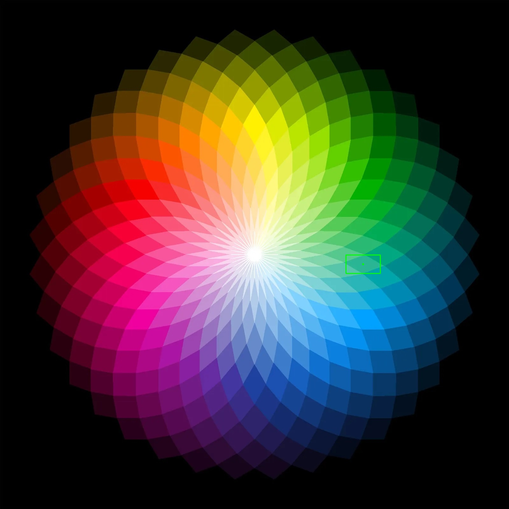
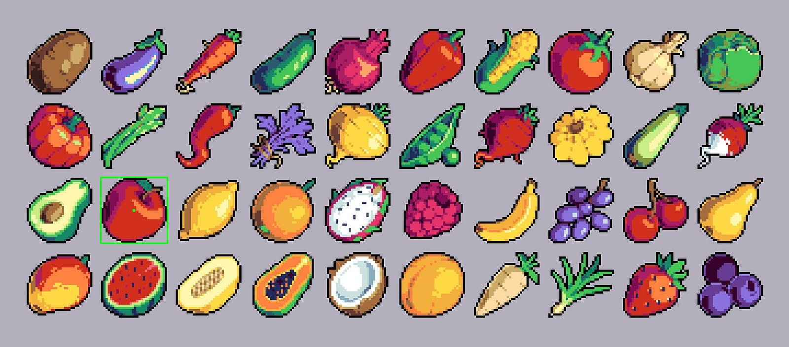

# VisualSense

It is a simple project for image matching and color detection.
---

## Test Results

### Color Detection Result

### Image Matching Result

---

## Copyright

Copyright (C) 2025 Sercan Bayrak

This program is free software: you can redistribute it and/or modify
it under the terms of the GNU General Public License as published by
the Free Software Foundation, either version 3 of the License, or
(at your option) any later version.

See the LICENSE file for the full license text.

